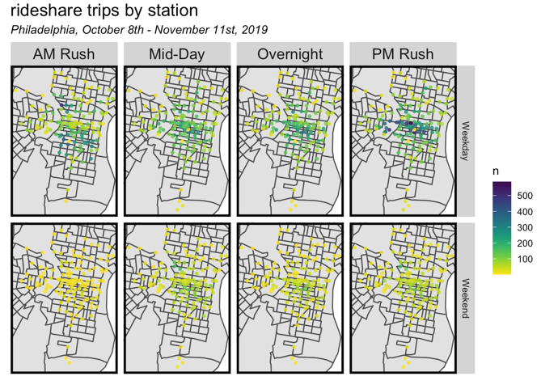
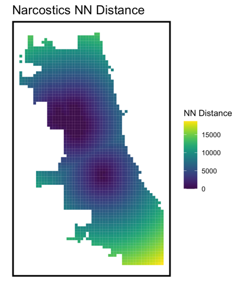

## Portfolio

---

### Spatial Data Analysis  

[Indego Ridership Prediction and Rebalancing](/sample_page)

---
[San Francisco On-street Parking Prediction: Demand-Responsive Pricing](/pdf/sample_presentation.pdf)

---
[Chicago Crime Prediction](http://example.com/)

---

### Category Name 2

- [Project 1 Title](http://example.com/)
- [San Francisco On-street Parking Prediction: Demand-Responsive Pricing](https://github.com/Zhen3r/pro-forma/blob/main/final.html)
- [Project 3 Title](http://example.com/)
- [Project 4 Title](http://example.com/)
- [Project 5 Title](http://example.com/)

---

---

Page template forked from <a href="https://github.com/evanca/quick-portfolio">evanca</a>

<!-- Remove above link if you don't want to attibute -->
