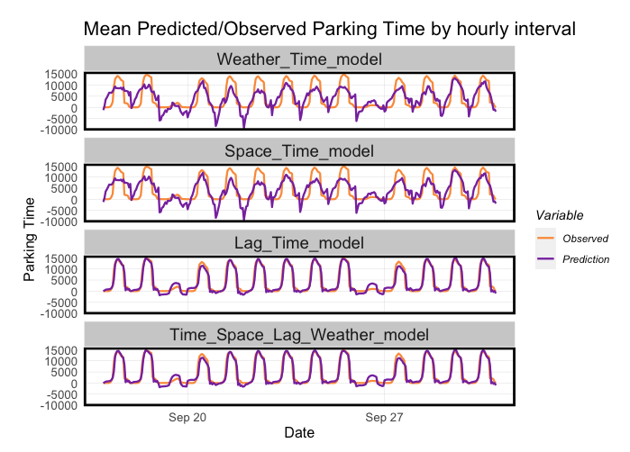

## Portfolio

---

### Spatial Data Analysis  

[Indego Ridership Prediction and Rebalancing](/sample_page)

---
[San Francisco On-street Parking Prediction: Demand-Responsive Pricing](/pdf/sample_presentation.pdf)

---
[Chicago Crime Prediction](http://example.com/)

---

### Related Course Projects

- [Indego Ridership Prediction and Rebalancing](https://github.com/inordia/portfolio/blob/change-the-layout/images/Assignment-6.html)
- [San Francisco On-street Parking Prediction: Demand-Responsive Pricing](https://inordia.github.io/portfolio/images/final.html)
- [Chicago Crime Prediction](https://inordia.github.io/portfolio/images/WangRan_Assignment3.html)
- [Online Food Vending: Urban Food System in China during COVID](https://arcg.is/1CL18O)

---

---

Page template forked from <a href="https://github.com/evanca/quick-portfolio">evanca</a>

<!-- Remove above link if you don't want to attibute -->
